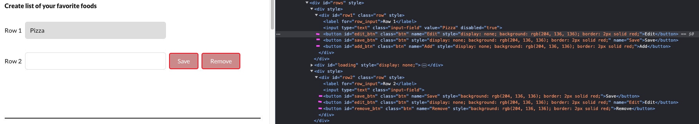

# XpathLocatorStrategies

This is a set of notes for Xpaths, from the Udemy Course ['XPath locators for Selenium'](https://www.udemy.com/course/xpath-locators-for-selenium/) by 'Dmitry Shyshkin'.

## Sección 1 - Recursos útiles del curso.

<details>

<summary> Seccion 1: Introducción - </summary>

<details>

<summary>Páginas Web</summary>

1. [Test Login](https://practicetestautomation.com/practice-test-login/)
2. [Test Exceptions](https://practicetestautomation.com/practice-test-exceptions/)
3. [GitHub Repo - XPath-locators-for-Selenium](https://github.com/dimashyshkin/XPath-locators-for-Selenium)

</details>

<details>

<summary>Plugins para facilitar la vida.</summary>

1. FireFox

   - xPath Finder

2. Chrome
   - Ranorex Selocity
   - SelectorsHub
   - CSS and XPath checker
   - Relative Xpath Helper
   - TruePath
   - Chro Path
   - Selectors Hub - XPath helper

</details>

### Shortcuts de Teclado

<details>

<summary>TRUCOS</summary>

En el explorador Google CHROME:

1. Abrir el Inspector de Elementos, para ver el Document Object Model (DOM).

   1. > CTRL + SHIFT + I
   2. > F12
   3. > Click Derecho > Inspeccionar

2. Abrir directamente abre el Selector de WebElements en el DOM.
   1. > CTRL + SHIFT + C
   2. > CTRL + F - Abre un buscador para validar Xaths

</details>

</details>

---

## Sección 2

<details>

<summary>Seccion 2: XPath Basics</summary>

### Xpath Meaning

<details>

<summary>Xpath significa</summary>

XML Path  Language it's a Query Language for selecting **nodes** from a XML document.

</details>

### XPATH Formula:

<details>

<summary>Xpath explicado</summary>

```
//tag[@attribute="value"]
```

</details>

### Estrategias de localización:

<details>

<summary>9 estrategias de localizacion</summary>

1. By locator = By.id("id_del_elemento");

2. By locator_name = By.name("name_elemnt");

3. By locator_className = By.className("clase_elemento");

4. By locator_tagName = By.tagName("tag");

5. By locator_linktext = By.linkText("texto_link");

6. By locator_partialLinkText = By.partialLinkText("parte_texto");

7. By locator_cssSelector = By.cssSelector("input[name='q']");

8. By locator_Xpath = By.xpath("//input[@name='q']");

9. JavaScript

```
JavascriptExecutor js = (JavascriptExecutor) driver;

WebElement searchBox = (WebElement)js.executeScript("return document.getElementsByName('q')[0]");
```

</details>

### Inspector de Elementos

<details>

<summary>Todo es relativo</summary>

- Usando el elemento 'Submit', hacia arriba, tiene 2 'hermanos' y 1 'padre.


- Usando el 'Form', hacia abajo, tiene 3 hijos.


</details>

### Terminlogía de los XPaths

<details>

<summary>Conceptos</summary>

1. Tipos de **nodos** en Xpath:
   - Element
   - Attribute
   - Text
   - Document
   - etc..
2. **Atomic Values**:
   - Nodos SIN hijos ni Padres.
3. **Relaciones** entre Nodos:
   - Padre
   - Hijo
   - Hermano
   - Ancestro
   - Descendiente
4. Tipos de XPath:
   1. Absolutos
      - Manera directa de localizar un elemento
      - Comienzan desde el Origen del DOM.
      - No son robustos ni confiables  (se arruinan con cualquier cambio en la página antes de nuestro elemento)
   2. Relativos (los que debemos usar)
      - Comienzan desde un Nodo que nosotros elegimos.
      - Mas cortos y fáciles de leer.
      - Estrategia de localización mas robusta.

</details>

### Sintaxis Básica de XPath

<details>

<summary>XPath Relativo e Hijo</summary>

- Tenemos un elemento 'PADRE' tipo 'Div' con un 'Id'

  - Dentro tiene otras cosas, pero las que nos interesa es el INPUT

- Elemento PADRE, usado como `XPath Relativo` o referencia:

```
//div[@id='row2']
```


- Con este punto de partida, nos dirigimos al elemento HIJO, el único tipo `INPUT`.
- Como no hay otro similar, el XPath queda:

```
//div[@id='row2']/input
```


</details>

### Diferencia entre '/' vs '//' vs './' vs '..//'

<details>

<summary>Diferencias clave en Nodos</summary>

---

1.  / - una diagonal
    - Usado al inicio del XPath, selecciona un elemento RAÍZ.
    - Usado para crear XPaths Absolutos
    - Abreviación de 'Child Node' - Nodo Hijo

#### Ejemplo 1:

```
/HTML/Body
```

El elemento raíz `HTML` contiene 2 hijos, `HEAD`y `BODY`


---

2.  // - doble diagonal

    - Abreviatura de 'descendiente' o 'Self Node'.
    - Para 'XPaths Relativos'
    - Selecciona un elemento en cualquier lugar de la página.

#### Ejemplo 2:

- Usando un elemento relativo, vamos buscando todos los elementos hijos en el árbol del DOM hasta encontrar los de tipo 'INPUT'.

- En este caso son 2 distintos.

```
//div[@id='rows']/div/div/input
```


**NOTA:** podemos `anidar` NODOS RELATIVOS para usar el Nodo Padre como nuevo RAIZ.

El XPath anterior, se puede reescribir como

```
//div[@id='rows']//input
```

Obteniendo el mismo resultado:

- **Dentro** del DIV element con ID = 'rows' (`Nodo Relativo`), **BUSCA** en cualquier lugar **elementos descendiente** con TAG tipo `INPUT`.


---

3. Uso de .// con 'Context Element'

- Este necesita un 'Context Element' en SELENIUM para funcionar, de otro modo no hace nada en el Navegador.
- Este es el código

```java
package com.practicetestautomation;

import java.util.List;

import org.openqa.selenium.By;
import org.openqa.selenium.WebElement;
import org.openqa.selenium.support.ui.ExpectedConditions;
import org.openqa.selenium.support.ui.WebDriverWait;
import org.testng.Assert;
import org.testng.annotations.Test;

public class RelativeXpathTests extends BaseTest {

	private String url = "https://practicetestautomation.com/practice-test-exceptions/";

	@Test(priority = 1)
	public void relativeXpathTest() {
		driver.get(url);

		// Find and click 'Add' button to add second row
		WebElement addButton = driver.findElement(By.id("add_btn"));
		addButton.click();

		// Use Explicit wait to wait for the second row to be visible
		WebDriverWait wait = new WebDriverWait(driver, 15);
		wait.until(ExpectedConditions.visibilityOfElementLocated(By.xpath("//div[@id='row2']")));

		// Get list of all rows
		List<WebElement> rows = driver.findElements(By.xpath("//div[@id='row2']/*[@id='save_btn']"));

		String actualText = null;

		// Iterate over each row in the list - this 'row' are the CONTEXT ELEMENT
		for (WebElement row : rows) {
			// Get text from label element for each 'row'
			String label = row.findElement(By.xpath(".//label")).getText(); // Look for //label inside CONTEXT ELEMENT
			System.out.println("Label text is: " + label);

			if (label.equals("Row 2")) {
				// If label equals Row 2, type Sushi into input field
				System.out.println("Typing 'sushi' into input field");
				row.findElement(By.xpath(".//input")).sendKeys("Sushi"); // Look for //label inside CONTEXT ELEMENT

				// Save new value by pushing Save button
				driver.findElement(By.xpath("//div[@id='row2']/*[@id='save_btn']")).click();

				// Get new value to use in the assertion
				actualText = row.findElement(By.xpath(".//input")).getAttribute("value"); // Look for //input inside CONTEXT ELEMENT
				break;
			}
		}
		Assert.assertEquals(actualText, "Sushi");
	}
}
```

</details>

### Diferencia entre 'Position' e 'Index'

<details>

<summary>XPath con múltiples resultados, y los métodos para definir elementos.</summary>

- Cuando encontramos una página que nos arroja varios resultados para un XPath, requerimos definir cuál es el elemento que queremos.

- Por ejemplo, en la página bajo prueba, si elegimos un elemento `H5` nos encuentra 6 resultados.

- `NOTA`: En los XPaths, los índices comienzan en '1', no en 'CERO' como los lenguajes de programación.

```
//H5
```


</details>


---


<details>

<summary>INDEX</summary>

- Un Índice XPath comienza en '1'

```
//H5[2]
```

- Para elegir un único elemento XPath, debemos encerrar entre `paréntesis cuadrados` la dirección del elemento.


- Para XPaths con `atributos`, se debe encerrar entre `paréntesis` el XPath completo y al final entre `corchetes` se coloca el índice.

```
(//div[@class='row'])[2]
```


---

- Ahora, digamos que dentro de este elemento, queremos el botón `REMOVE`. 
- Podemos usar la búsqueda de elementos hijos de este elemento.

```
(//div[@class='row'])[2]/button[3]
```


- Pero, podemos mejorar el XPath, teniendo en cuenta una consideración del método `INDEX`.

- `OJO` : si escribimos este comando, nos dará como resultado que efectivamente encontró los 6 botones, que coinciden con el criterio de búsqueda:


```
//div[@class='row']/button
```




- `PERO` si ponemos los corchetes, NO va encontrar nuestro elemento.

```
//div[@class='row']/button[6]
```

- Por que, XPath va a buscar dentro del `PRIMER` elemento que cumpla la condición de ser DIV y tener clase ROW, el sexto elemento tipo BUTTON.

- Y sabemos por el DOM que sólo contiene 3 elementos.

- La sintaxis correcta, es nuevamente, envolver TODO el XPath entre `paréntesis` para que PRIMERO busque TODOS los elementos tipo BUTTON dentro de TODOS los DIV con clase ROW.


```
(//div[@class='row']/button)[6]
```

- Y ahora sí, encontrados TODOS, elegir ya sea el último, o el índice '6'.


```
(//div[@class='row']/button)[last()]
```

- De esta manera, encerrando entre paréntesis todo el XPath para buscar primero todos los elementos, también funciona el truco del comando 'last()'.

</details>


---

<details>

<summary>position()</summary>

- Así como el Index, el comando `[position()=X]` también arroja un único elemento XPath por `punteros`.

```
//H5[position()=3]
```

- Si hacen lo mismo, ¿para qué sirve?


Por que, a diferencia de INDEX, con `POSITION` podemos jugar con los `punteros`.


---

---


- Imaginemos que por alguna razón NO necesitamos el primer resultado, sólo los que dicen 'Test Case X: ...'

- SABIENDO que el elemento que NO queremos está en la `primera posición`, podemos excluirlo de la búsqueda con XPath.


```
//H5[position()!=1]
```

- De esta manera podemos elegir todos los elementos `H5`, excluyendo el primero, y ahora únicamente encontrará 5 elementos.


- `POSITION`es un método versátil, con el que podemos conseguir el mismo resultado combinando los operadores.


</details>


---

<details>

<summary>last()</summary>

- Si no sabemos el número de elementos, pero estamos seguros de que el que necesitamos es el último, podemos usar `LAST` como comando.

```
//H5[last()]
```

- Y seleccionará el último elemento del tipo que le indiquemos:


- Siendo posible además, elegir en reversa desde esa posición, similar al sistema de `arrays`de Python.

```
//H5[last()-1]
```


</details>

### XPaths Functions - TEXT

---

<details>

<summary>text()</summary>

- La fórmula para encontrar un elemento por su TEXTO es:

```
//tag[text()='value']
```

- PERO, se debe escribir el texto COMPLETO tal cual aparece en el DOM.

```
//h5[text()='Create list of your favorite foods']
```


- Otra manera de lograr el mismo resultado es:

```
//h5[normalize-space()='Create list of your favorite foods']
```

- Funciona para cualquier tipo de elemento que contenga TEXTO.

```
//a[text()='Selenium WebDriver with Java for beginners program']
```


</details>

---

### XPath Functions - contains

<details>

<summary>contains()</summary>

- Esta función es útil para `elementos parcialmente dinámicos`.
- Permite seleccionar un elemento por el contenido `parcial` de un `atributo` en el DOM.

Por ejemplo, si un ID tiene valores `parcialmente dinámicos`.


- La fórmula es:

```
//tag[contains(@attribute,'partial value')]
```


- También es útil con, por ejemplo, `etiquetas` tipo `CLASS` que contienen atributos muy largos.
- Podemos encontrar el mismo elemento sin necesidad de escribir todo el `valor`.

```
//body[contains(@class,'page-template-test_exceptions')]
```


- También podemos encontrar varios elementos que comparten cierta característica.

```
id="edit_btn"
id="save_btn"
id="add_btn"
```


```
$x("//button[contains(@id,'_btn')]")
```


- Finalmente, podemos encontrar un elemento por su `texto parcial` usando XPath.
- En lugar del atributo, usamos la función `text` dentro de `contains` de la siguiente manera.


- Escribimos sólo una parte del texto del elemento.

```
$x("//p[contains(text(),'This page is created')]")
```


- FIN

</details>

---

### XPath Function - Starts with

<details>

<summary>starts-with()</summary>

- Esta función es similar a `contains()`, pero es mas específica en su sintaxis.
- Requiere, como su nombre lo indica, únicamente el inicio del `valor` del `atributo`.
- La fórmula es:

```
//tag[starts-with(@attribute,'beginning')]
```

Por ejemplo, para el elemento:


- Con código HTML:

```
 <input type="text" class="input-field" value="Pizza" disabled="true">
```

- Podemos usar el `valor` del  `atributo` 'CLASS'
- Y el XPath con la función `starts-with()` quedaría de la siguiente manera:

```
//input[starts-with(@class,'input')]
```


- De la misma manera que con `contains()`, podemos usar esta función para encontrar `TEXTO`.


- Por ejemplo, para este elemento, podemos usar el siguiente XPath.

```
//p[starts-with(text(),'This page')]
```


</details>

### Otro Terminlogía

<details>

<summary>Tema Nuevo</summary>

You can add text HERE.

</details>

</details>

---

## Seccion 3

<details>

<summary>Seccion 3: Advanced XPath</summary>

You can add text within a collapsed section.

You can add an image or a code block, too.

</details>

---

## Seccion 4

<details>

<summary>Seccion 4: Pros & Cons de XPath</summary>

You can add text within a collapsed section.

You can add an image or a code block, too.

</details>

---

## Seccion 5

<details>

<summary>Seccion 5: Trucos locos</summary>

---

<details>

<summary>Podemos usar un '*' en lugar del TAG.</summary>

```
//tag[@attribute="value"]      ->  //*[@id="validationCustom01"]
```


</details>

---

<details>

<summary>Podemos probar los XPaths directamente en el Navegador</summary>

> CTRL + SHIFT +I > Console

Usamos la siguiente sintaxis:

> $x("//\*[@id='validationCustom01']")


**TIP:** Todo dento de comillas dobles, deben ser comillas SIMPLES, por Sintaxis. 'Valores' de las etiquetas.

</details>

</details>

---
